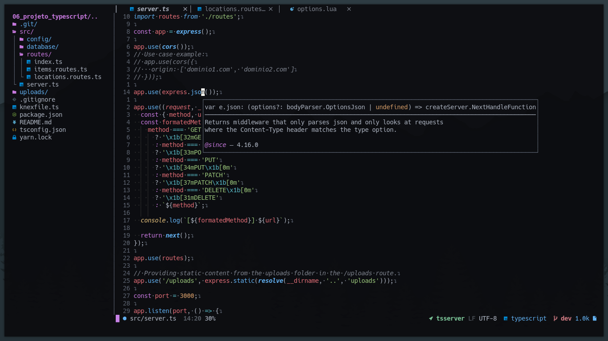

# nvim
## My personal Neovim settings written in Lua
### Setup:
```bash
git clone https://github.com/JoaquimGregorio/nvim ~/.config/
```
- Resolve all dependencies by reading the *~/.config/nvim/lua/plugins/init.lua* file and looking at the plugins and these requirements.

### Look (nvimtree and lsp doc hover)

